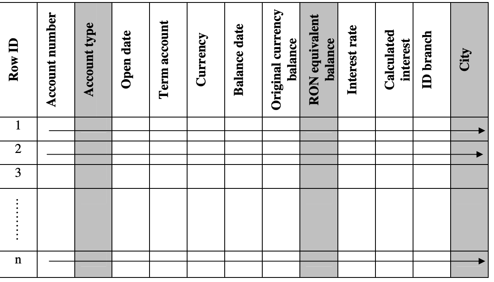
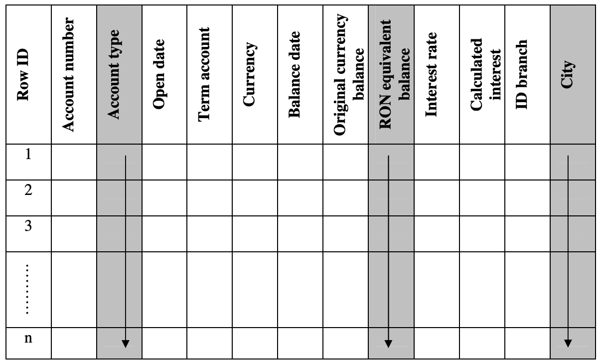

# Column-Oriented Databases: An Alternative for Time Series Data

It is widely accepted that a data warehouse is the
central place of any Business Intelligence system.
It stores all data that is relevant for the application,
data that is acquired both from internal and external sources.
In our case, we store a large amount of timeseries metric data that
is then processed to generate reports. The growth of the data we collect
grows exponentially with respect to time.

This paper presents column-oriented databases,
which are considered an element of the new generation of DBMS technology.

The paper emphasizes the need and the advantages of
these databases for an analytical environment and
make a short presentation of two of the DBMS built in a columnar approach.

## Table of Contents

!todo

## Introduction

In the evolution of computing science, three generations of database technology are
identified since till date.

The first generation started in the 60’s and its main purpose was to
enable disparate but related application to share data
otherwise than passing files between them.

The publishing of “A Relational Model of Data for Large Shared Data Banks”
by E. F. Codd marked the beginning of the second generation of
DBMS(database management systems) technology. Codd’s premise was that data
had to be managed in structures developed according to the mathematical set theory.
He stated that data had to be organized into tuples, as attributes and
relations.

A third generation began to emerge in the late 90’s and
now is going to replace second-generation products.
As multi-core processors became common, 64-bit technology is used largely for database
servers, memory is cheaper and disks are cheaper and faster than ever before.

A recent IDC study [1] examines emerging trends in DBMS technology as
elements of the third generation of such technology.
It considers that, at the current rate of development and adoption, the
following innovations will be achieved in the next five years:

- most data warehouses will be stored in a columnar fashion;

- most OLTP (On-Line Transaction Processing) databases will either be
  augmented by an in-memory database or reside entirely in memory;

- most large-scale database servers will achieve horizontal scalability through
  clustering;

- many data collection and reporting problems will be solved with databases that
  will have no formal schema at all.

This study examines how some innovations in database technology field are
implemented more and more. Most of these technologies have been developed for at
least ten years, but they are only now becoming widely adopted.
As Carl Olofson, research vice president
for database management and data integration software research at IDC,
said, “many of these new systems encourage you
to forget disk-based partitioning schemes, indexing strategies and buffer management,
and embrace a world of large-memory models, many processors with many cores,
clustered servers, and highly compressed columnwise storage”.
From the innovations that the study considers that will be achieved in the next
years, this paper presents the columnar data storage.

## The need for column-oriented databases

For profiling, the aquired raw data grows rapidly with respect to time. And so does
the time it takes to process the data into a `report` that can then be presented.

Data analysis and reporting need more and more resources. Therefore, better, faster
and more effective alternatives have to be found. Business Intelligence (BI) systems
are proper solutions for solving the problems above. Decision-makers need a
better access to information, in order to make accurate and fast decisions in a
permanent changing environment. As part of a BI system, reporting has become critical
for an end user. <!--todo need to reword user-->

For us reporting is an instrument addressed to decision-makers on all
levels, aiming to improve the software and hardware activity, to ensure decision
quality, control costs and prevent losses.

As already mentioned, the volume of
data acquired is growing permanently, because software day after day is becoming
more complex and

<!---and something--->

More than ever before, users need a faster and more
convenient access to `Time Series Data`.
More and more reports and adhoc queries are requested to support the
decision making process.
More and more hardware resources are needed in order to
store and manage an increasing volume of
data. The increasing number of queries needs larger amounts of CPU cycles, so
more processors, having a higher performance, must be added to the system.

The size of the data warehouses storing this data is increasing permanently,
becoming larger and larger.

The challenge is to maintain the performance of these repositories,
which are built, mostly, as relational structures, storing data
in a row-oriented manner.

The relational model is a flexible one and it has proven its capacity
to support both transactional and analytical processing.
But, as the size and complexity of data
warehouses have increased, a new approach was proposed as an alternative
on the roworiented approach, namely storing data in a
column-oriented manner.

Unlike the roworiented approach, where the data storage
layer contains records (rows), in a columnoriented system it contains columns.

This is a simple model, more adequate for data repositories used by analytical applications
such as ours, with a wide range of users and query types.

Growth rates of system hardware performance are being overrun by the need
for analytical performance [2]. The volume of data needed to be
stored is growing due to more and various requirements for reporting
and analytics, increased time periods for data retention,
a greater number of observations loaded in data warehouses and a greater
number of attributes for each observation.

Row-oriented databases have been designed for transactional processing. For
example, in the account management system of a bank, all attributes of an account
are stored in a single row. Such an approach is not optimal in an analytical system,
where a lot of read operations are executed in order to access a small number of
attributes from a vast volume of data.
In a row-oriented architecture, system performance, users’
access and data storage become major issues very quickly [3].

As they are designed to retrieve all elements from several rows,
roworiented databases are not well suited for large scale processing,
as needed in an analytical environment. As opposed to transactional queries,
analytical queries typically scan all the database’s records,
but process only a few elements of them. In a column-oriented
database all instances of a single data element, such as account
number, are stored together so they can be accessed as a unit.
Therefore, columnoriented databases are more efficient in an analytical environment,
where queries need to read all instances of a small number of data elements.

System performance enhances spectacularly in a column-oriented solution,
because queries search only few attributes, and they will not scan the attributes
that are irrelevant for those queries. Requested data is found faster,
because less sort operations have to be performed.

As the volume of data becomes impressive and performance
demands required by users are likely to outpace, it is obviously that row-oriented
relational database management systems stopped to be the solution for implementing
a system having powerful analytical and predictive capabilities. A new model tends
to come into prominence as an alternative on developing analytical databases,
namely one that manages data by columns.

A column-oriented DBMS stores data in a columnar manner and not by rows, as
classic DBMS do. In the columnar approach, each attribute is stored in a
separate table, so successive values of that attribute are stored consecutively.
This is an important advantage for data warehouses where, generally,
information is obtained by aggregating a vast volume of data.
Therefore, operations as MIN, MAX, SUM, COUNT, AVG and so forth are performed
very quickly [4].

When the tables of a database are designed, their columns are established. The
number of rows will be determined when the tables will be populated with data.
In a roworiented database, data is stored in a tabular manner.
The data items of a row are stored one after another; rows are also stored one
after another, so the last item of a row is followed by the first item
of the next row. In a column-oriented database, the data items of a column are
stored one after another, and also are the columns; so the last
item of a column is followed by the first item of the next column.

## Differences between the row-oriented and column-oriented approaches

In a typical relational DBMS, data is stored and managed as rows, each row
containing all the attributes of an element of that entity (table).
Such systems are used by transactional applications which, at a certain
moment, generate or modify one or a small number of records. Unlike transactional
applications, which use all, or almost all the attributes of a record, analytical
applications scan few attributes (columns) of a vast number of records.
Most often, they have to aggregate data stored in those columns in order to
meet the users’ demands.
Because of the row-oriented structure of the database, the entire record
has to be read in order to access the required attributes.
This fact causes the reading of a vast amount of unuseful additional data in
order to access the requested information.

### Figure 1: Analytical request in a row-oriented database

<!--todo update with example from uprof timeseries data--->

shows that much more data than needed is read to satisfy the request for
the total volume of term deposits opened at the branches in Bucharest.



Row-oriented databases were designed for transactional applications, and they are
optimized for retrieval and processing of small data sets. Seldom, to support
analytical requests, it is necessary to build additional indexes,
pre-aggregating data structures, or special materialized views and cubes.
All these aspects require additional processing time and data storage.
However, because they are built in order to provide quickly results for
queries that were known at the design stage, they will not have the
same performance when ad-hoc queries, that were not foreseen before, are performed.

Our application demands require the storage of many data items. But any user
wants to get information as soon as possible. Therefore, a proper solution for data
organization has to be implemented in order to ensure a good performance of the system.
Several technical solutions can be used to improve system performance, such as
partitioning, star indexes, query preprocessing, bitmap and index joins, or
hashing. These solutions aim to offer support for more specific data retrieval, but
they still have to examine the entire content of a row.

Taking into consideration those presented above, a new approach was
proposed, to store data along columns. In such data organization, each column is
stored separately and the system selects only the columns requested by users.
In every column data is stored in row order, so that the 50th entry
for each column belongs to the same row, namely the 50th row.

Figure 2 shows that the same query as those in figure 1 reads less data in a
columnoriented system, in order to provide the same result.
No additional indexes have to be built for improving query performance,
because every column forms an index. This fact reduces the number of I/O operations
and enables quick access to data, without the need to read the entire database.
Data from each column is stored contiguously on disk. Column values are
joined into rows based on their relative position in each column. As
a result of the column-oriented architecture, only those columns needed for a specific
query are read form disk. Because in an analytical environment most of queries need
to retrieve only few columns, this vertical partitioning approach produces important
I/O savings. This fact contributes to system performance improvement, as regards
the query execution time.

### Figure 2: Analytical request in a column-oriented database



<!--todo add an example from profiling--->

> Figure 2 presents a reunion of the tables in a column-oriented database. In fact,
> each table has two columns: one containing the row ID, and the other,
> the values of the appropriate attribute. Because of the limited
> space on the page, the row ID column is not multiplied for every table,
> and the attribute columns are close together.

Comparing the two figures above, it’s easy to observe that the same request has to
read more data in a row-oriented structure than in a column-oriented one.
In order to read a certain attribute in a row-oriented structure,
all the adjacent attributes have to be read, even if they are not interesting for
the requester. In a column-oriented structure, since all values of an attribute are
stored together, consecutively, this problem doesn’t exist [5].

A column-oriented database is faster than a row-oriented one, because its
processing is not affected by unnecessary content of rows. As long as many database
tables can have dozens of columns and most business requests need only a few of them,
the columnar approach is a proper solution for analytical systems.

<!---if we talk about query Optimization, add a follow back here-->

Talking about the efficiency of a column-oriented system, some remarks are
to be made concerning processing time. Thus, such a system is more efficient when
it’s necessary to aggregate a large number of rows, but only a small number of columns
are requested. If many columns of a small number of rows have to be processed,
a roworiented system is more efficient than a column-oriented one.
The efficiency is even greater when row size is relatively small,
because the entire row can be retrieve with a single disk seek.
Updating an entire column at once is faster in a column-oriented database. All the
data of that column is modified through only one updating command, without
the need to read all columns of each row. But writing or updating a
single row is more efficient in a row-oriented database if all attributes
are supplied at the same time, because the entire row can be written with
a single disk access, whereas writing to multiple columns
requires multiple writes. SQL queries in a column-oriented
database are identical with those in a roworiented database, without any modification.
What is different, is the way that the database administrator has to think about
data. While in a row-oriented database he thinks in terms of individual transactions,
in a column-oriented database he has to think in terms of similar items derived
from sets of transactions. From the indexing point of view, he has to pay more
attention to the cardinality of the data, because an index is related with a
subject, such as the balance account, and not with an entire transaction
with all its fields.

## Advantages of the column-oriented approach

Column-oriented databases provide important advantages towards the roworiented ones,
some of them being presented below.

Column-oriented databases provide a better performance for analytical requests.
In the row-oriented approach, the system performance decreases significantly as the
number of simultaneous queries increases. Building additional indexes in order
to accelerate queries becomes uneffective with a large number of diverse queries,
because more storage and CPU time are required to load and maintain those indexes.
In a column-oriented system indexes are built to store data, while in a
row-oriented system they represent the way to point to the storage area that
contains the row data. As a result, a column-oriented system will read only
the columns required in a certain query.

On the other hand, as they store data as blocks by columns rather than by rows, the
actions performed on a column can be completed with less I/O operations. Only
those attributes requested by users are read from disk. Although a row-oriented table
can be partitioned vertically, or an index can be created for every column so
it could be accessed independently, the performance is significantly lower than
in a columnoriented structure [6]. And taking into consideration that I/O
operations are the bottleneck of a database application, the column-oriented
approach proves its superiority against the row-oriented one.
Unlike the row-oriented approach, the column-oriented approach allows rapid
joins and aggregations. Tables are already sorted, so there is no need to sort them
before merge or join them. In addition, accessing data along columns allows
incremental data aggregation, which is very important for analytical applications.
In addition, this approach allows parallel data access, improving the system performance.
Thereby, complex aggregations can be fulfiled by the parallel processing of
columns and then joining data in order to achieve the final result.

Column-oriented databases need a smaller disk space to store data than roworiented databases.
To accommodate the sustained increase of volume of data, additional structures –
as indexes, tables for pre-aggregation and materialized views, are built in
row-oriented systems. Columnoriented databases are more efficient structures.
They don’t need additional storage for indexes, because data is stored
within the indexes themselves. Bitmap indexes are used to optimize data store and
its fast retrieval. That’s why in a columnoriented database queries are more efficient
than in a row-oriented one.

Moreover, a higher data compression rate can be achieved in a column-oriented
database than in a row-oriented one. It is well known that compression is more
effective when repeated values are presented, and values within a column are
quite similar to each other. A columnoriented approach allows the ability to
highly compress the data due to the high potential for the existence of similar values
in adjacent rows of a certain column. In a row-oriented database, values in a
row of a table are not likely to be very similar; therefore, they cannot be
compressed as efficient as in a column-oriented database.

Concerning the repository presented in figures 1 and 2, there is no doubt that
many repeated values will be found within the CITY column, but no repetition
will be found between CITY and another attribute in a row.

Data loading is a faster process if it’s executed in a column-oriented database than
in a row-oriented one. As known, to load data in a data warehouse involves to perform
more activities. Data is extracted from source systems and loaded into a staging
area. This is the place where data transformations and joins are performed in
order to denormalize data and load it into the data warehouse as fact and dimension
tables. Then the needed indexes and views are created. In a row-oriented structure,
all data in a row (record) is stored together, and indexes are built taking into
consideration all the rows. In a column-oriented structure, data of each column
is stored together and the system allows the parallel loading of the
columns, ensuring a shorter time for data loading.

Taking into consideration the features presented above, it can be stated that a
column-oriented database is a scalable environment that keeps providing fast
queries when the volume of data such as in Time Series Data, the number of users and the number of
simultaneous queries are increasing. But this thing doesn’t mean that all
repositories have to be built in a columnar manner.
A column-oriented architecture is more suitable for data warehousing, with
selective access to a small number of columns, while a row-oriented one is a
better solution for analytical systems.
For an analytical system, which is heavily loaded with interactive transactions,
a row-oriented architecture is well-suited. All data for a certain row is stored
as a block. In such an architecture, all the attributes of a record are
written on disk with a single command, this thing ensuring a high performance for
writing operations. Usually, an operation in such a system creates, queries or changes an
entry in one or more tables. For an analytical system designed for analytical purposes, which
involve processing of a large number of values of few columns, a column-oriented
architecture is a better solution. A data warehouse, which is the central place of an
analytical system, must be optimized for reading data. In such an architecture, data
for a certain column is stored as a block, so the analytical queries, which usually
aggregate data along columns, are performed faster. A column-oriented system
reads only the columns required for processing a certain query, without bringing
into memory irrelevant attributes. Such an approach provides important advantages
concerning the system performance, because typical queries involve aggregation of large
volumes of data [7].

## Examples of columnar store

### Columnoriented Database System

Besides the column-oriented approach, another important innovation applied in data
warehousing consists in the way in which data is processed. Two major techniques are
used to design a data warehouse architecture: symmetric multiprocessing
(SMP) and massively parallel processing (MPP). It couldn’t be certified the
superiority of one approach against the other. Each of these solutions has its own
supporters, because both of them are valid approaches and, when properly applied, lead
to notable results. Two database systems are presented in
the next sections, each of them using one of the two types of architecture.

#### DuckDB

DuckDB is a high-performance analytical database system.
It is designed to be fast, reliable, portable, and easy to use.
DuckDB provides a rich SQL dialect, with support far beyond basic SQL.
DuckDB supports arbitrary and nested correlated subqueries, window functions,
collations, complex types (arrays, structs, maps), and several extensions designed
to make SQL easier to use.

A DuckDB is different from a conventional relational database, because its
main purpose is to allow data analysis and not its writing or updating. While in a
conventional database the most important thing is to allow many users to update the
database instantly and accurately, without interfering with one another, in a DuckDB
database the most important thing is to ensure fast query response for many users.

DuckDB has a column-oriented structure and has its own indexing
technology that ensures high performance to reporting and analytical queries,
which are performed, as its developers state.
DuckDB is designed to support analytical query workloads. These workloads are
characterized by complex, relatively long-running queries that process significant
portions of the stored dataset, as we have talked above.

Changes to the data are expected to be rather large-scale as well,
with several rows being appended, or large portions of tables being
changed or added at the same time.

To efficiently support this workload, it is critical to reduce the amount
of CPU cycles that are expended per individual value.
The state of the art in data management to achieve this are either vectorized or
just-in-time query execution engines.

DuckDB uses a columnar-vectorized query execution engine, where queries are still
interpreted, but a large batch of values (a "vector") are processed in one operation.
This greatly reduces overhead present in traditional systems such as PostgreSQL,
MySQL or SQLite which process each row sequentially. Vectorized query execution
leads to far better performance in OLAP queries.

### Columnoriented Data Store Formats

#### Apache Parquet

Apache Parquet is a column-oriented data file format designed for efficient data
storage and retrieval. It provides high performance compression and encoding
schemes to handle complex data in bulk and is supported in many programming language
and analytics tools.

##### Parquet File Format

```bash
    4-byte magic number "PAR1"
    <Column 1 Chunk 1>
    <Column 2 Chunk 1>
    ...
    <Column N Chunk 1>
    <Column 1 Chunk 2>
    <Column 2 Chunk 2>
    ...
    <Column N Chunk 2>
    ...
    <Column 1 Chunk M>
    <Column 2 Chunk M>
    ...
    <Column N Chunk M>
    File Metadata
    4-byte length in bytes of file metadata (little endian)
    4-byte magic number "PAR1"
```

In the above example, there are N columns in this table, split into M row groups.
The file metadata contains the locations of all the column chunk start locations.
More details on what is contained in the metadata can be found in the Thrift definition.

File metadata is written after the data to allow for single pass writing.

Readers are expected to first read the file metadata to find all the column chunks
they are interested in. The columns chunks should then be read sequentially.

The format is explicitly designed to separate the metadata from the data.
This allows splitting columns into multiple files, as well as having a single
metadata file reference multiple parquet files.


#### Apache Arrow

Apache Arrow defines a language-independent columnar memory format for flat
and nested data, organized for efficient analytic operations on modern hardware
like CPUs and GPUs. The Arrow memory format also supports zero-copy reads for
lightning-fast data access without serialization overhead.

The Apache Arrow format allows computational routines and execution engines
to maximize their efficiency when scanning and iterating large chunks of data.
In particular, the contiguous columnar layout enables vectorization using the
latest SIMD (Single Instruction, Multiple Data) operations included in modern processors.

## Conclution

For applications that write and update many data (analytical systems), a row-oriented
approach is a proper solution. In such an architecture, all the attributes of a
record are placed contiguously in storage and are pushed out to disk through a
single write operation. An analytical system is a writeoptimized one, having a
high writing performance.

In contrast, an analytical system, mainly based on ad-hoc queries performed against
large volumes of data, has to be readoptimized. Ad-hoc queries are then
performed in order to analyse data and discover the right information for the
decision making process. And for analytical applications, that read much more
than they write, a column-oriented approach is a better solution. Nowadays,
data warehouses have to answer more and more ad-hoc queries, from
a greater number of users which need to analyse quickly larger volumes of data.
Columnar database technology inverts the database’s structure and stores each
attribute separately, fact that eliminates the wasteful retrieval as queries
are performed. On the other hand, much more data can be loaded in memory,
and processing data into memory is much faster. Column-oriented databases provide
faster answers, because they read only the columns requested by users’ queries, since
row-oriented databases must read all rows and columns in a table.

Data in a columnoriented database can be better compressed than those in a
row-oriented database, because values in a column are much more homogenous than
in a row. The compression of a column-oriented database may reduce
its size up to 20 times, this thing providing a higher performance and reduced storage
costs. Because of a greater compression rate, a column-oriented implementation stores
more data into a block and therefore more data into a read operation.
Since locating them right block to read and reading it are two of
the most expensive computer operations, it’s obviously that a column-oriented approach
is the best solution for a data warehouse used by a Business Intelligence system
developed for analytical purposes.

## References

[1] Carl Olofson, The Third Generation of Database Technology: Vendors and
Products That Are Shaking Up the Market, 2010, [www.idc.com](www.idc.com)

[2] David Loshin, Gaining the Performance Edge Using a Column-Oriented
Database Management System, Sybase white paper, 2009, [www.sybase.com](www.sybase.com)

[3] Sybase, A Definitive Guide to Choosing a Column-based Architecture, White
paper, 2008, [A Definitive Guide to Choosing a Column-based Architecture](www.informationmanagement.com/white_papers/10002398-1.html)

[4] William McKnight, Evolution of Analytical Platforms, Information
Management Magazine, May 2009, [Evolution of Analytical Platforms, Information
Management Magazine](www.informationmanagement.com/issues/2007_58/analytics_business_intelligence_bi10015353-1.html)

[5] Daniel Abadi, Column-Stores For Wide and Sparse Data, 3rd Biennial
Conference on Innovative Data Systems Research, January 7 – 10,
2007, Asilomar, California, USA, [http://db.csail.mit.edu/projects/cstore/abadicidr07.pdf](http://db.csail.mit.edu/projects/cstore/abadicidr07.pdf)

[6] Daniel Abadi, Samuel Madden, Nabil Hachem,
Column-Stores vs. RowStores: How Different Are They Really?, Proceedings of the 2008,
ACM SIGMOD International Conference on Management of Data,
Vancouver, Canada, [http://portal.acm.org](http://portal.acm.org)

[7] Mike Stonebraker, Daniel Abadi et al., C-Store: A column-oriented DBMS,
Proceedings of the 31st VLDB Conference, Trondheim, Norway,
2005, [http://db.csail.mit.edu/projects/cstore/vldb.pdf](http://db.csail.mit.edu/projects/cstore/vldb.pdf)

[8] DuckDB [https://duckdb.org](https://duckdb.org)

[9] Apache Parquet [https://parquet.apache.org](https://parquet.apache.org)
